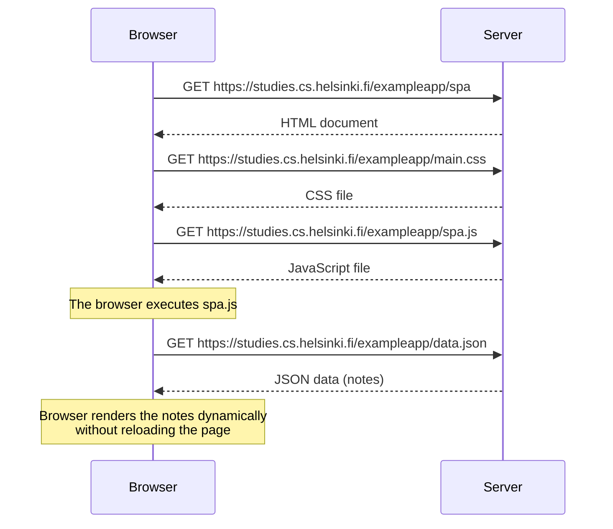

```mermaid
  sequenceDiagram
    participant B as Browser
    participant S as Server

    B->>S: GET https://studies.cs.helsinki.fi/exampleapp/spa
    S-->>B: HTML document

    B->>S: GET https://studies.cs.helsinki.fi/exampleapp/main.css
    S-->>B: CSS file

    B->>S: GET https://studies.cs.helsinki.fi/exampleapp/spa.js
    S-->>B: JavaScript file

    Note over B: The browser executes spa.js

    B->>S: GET https://studies.cs.helsinki.fi/exampleapp/data.json
    S-->>B: JSON data (notes)

    Note over B: Browser renders the notes dynamically<br/>without reloading the page
```