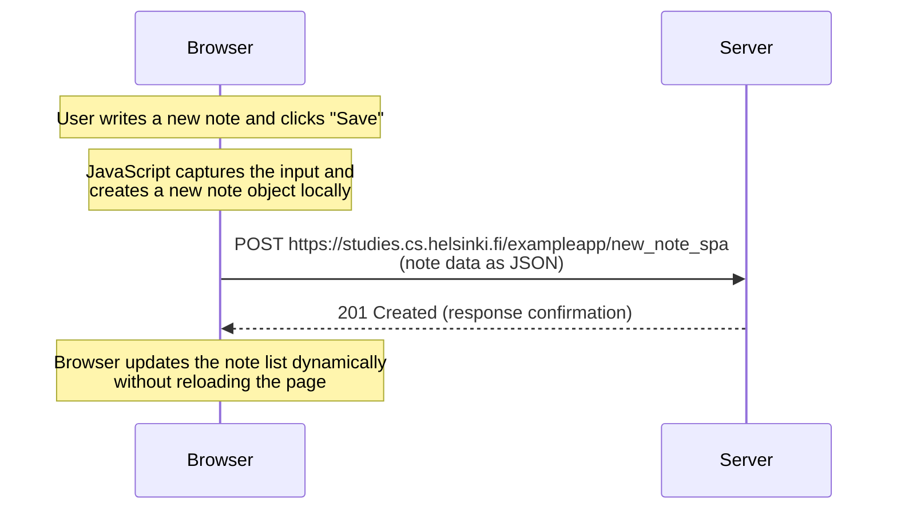

```mermaid
  sequenceDiagram
    participant B as Browser
    participant S as Server

    Note over B: User writes a new note and clicks "Save"

    Note over B: JavaScript captures the input and<br/>creates a new note object locally

    B->>S: POST https://studies.cs.helsinki.fi/exampleapp/new_note_spa<br/>(note data as JSON)
    S-->>B: 201 Created (response confirmation)

    Note over B: Browser updates the note list dynamically<br/>without reloading the page
```