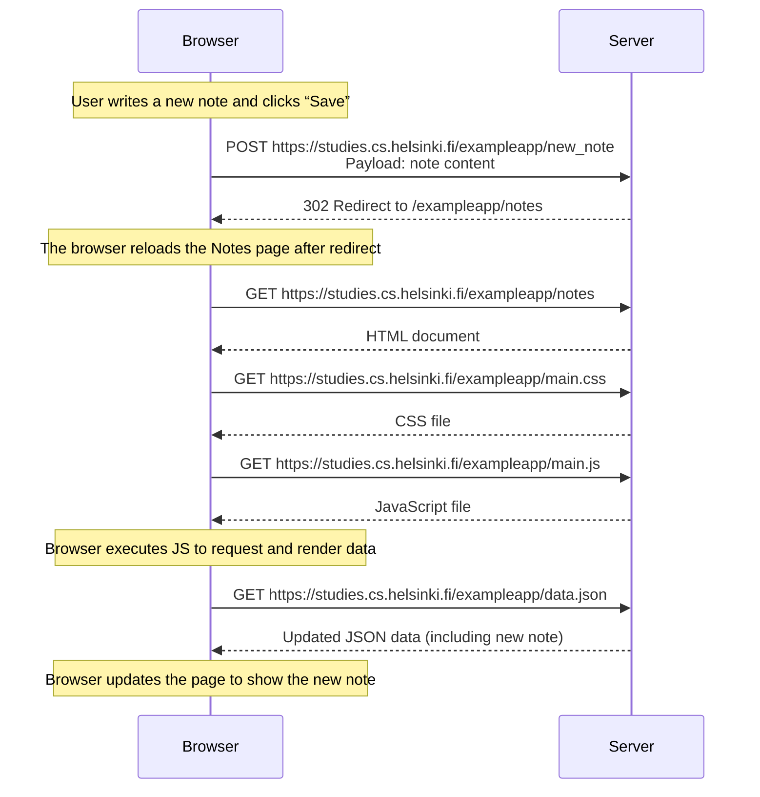

```mermaid
  sequenceDiagram
    participant B as Browser
    participant S as Server

    Note over B: User writes a new note and clicks “Save”

    B->>S: POST https://studies.cs.helsinki.fi/exampleapp/new_note<br/>Payload: note content
    S-->>B: 302 Redirect to /exampleapp/notes

    Note over B: The browser reloads the Notes page after redirect

    B->>S: GET https://studies.cs.helsinki.fi/exampleapp/notes
    S-->>B: HTML document

    B->>S: GET https://studies.cs.helsinki.fi/exampleapp/main.css
    S-->>B: CSS file

    B->>S: GET https://studies.cs.helsinki.fi/exampleapp/main.js
    S-->>B: JavaScript file

    Note over B: Browser executes JS to request and render data

    B->>S: GET https://studies.cs.helsinki.fi/exampleapp/data.json
    S-->>B: Updated JSON data (including new note)

    Note over B: Browser updates the page to show the new note
```